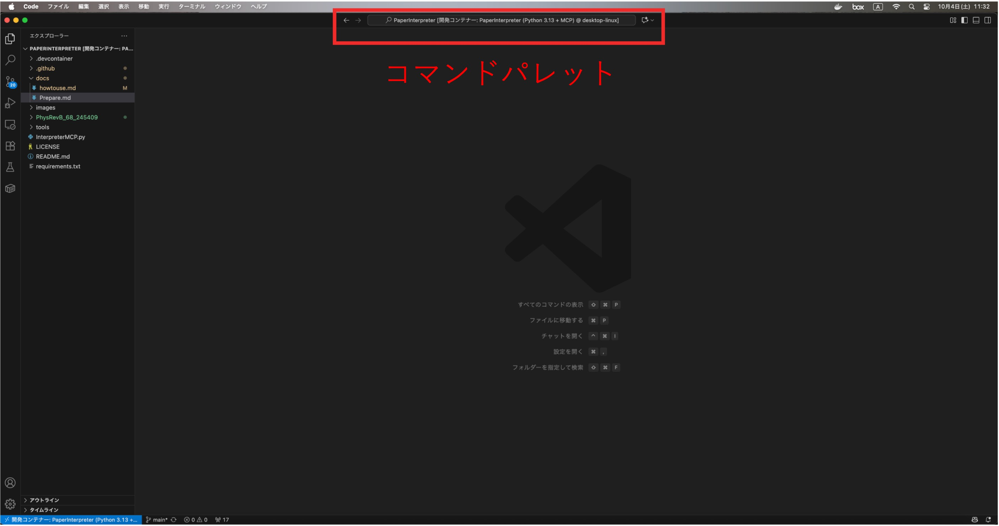
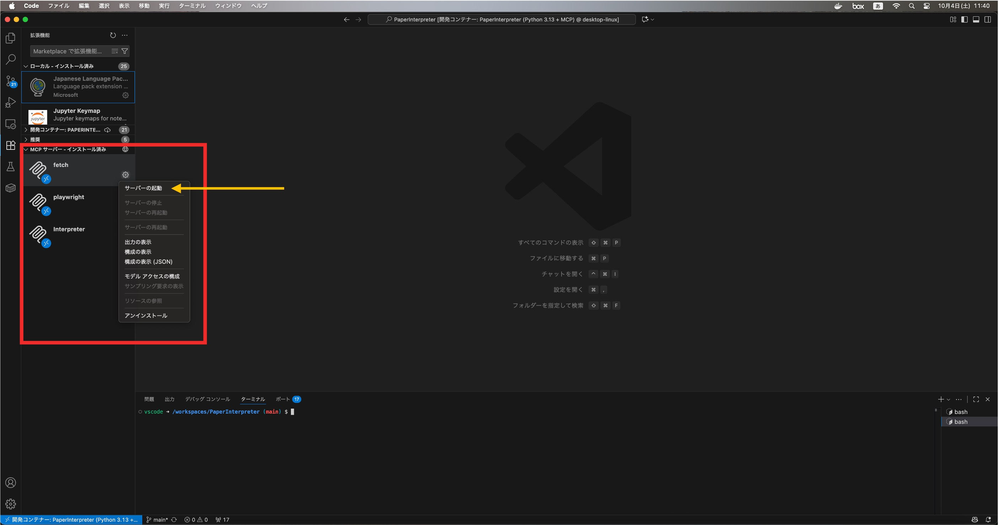
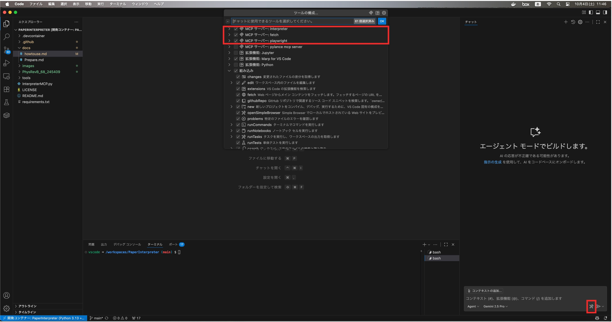
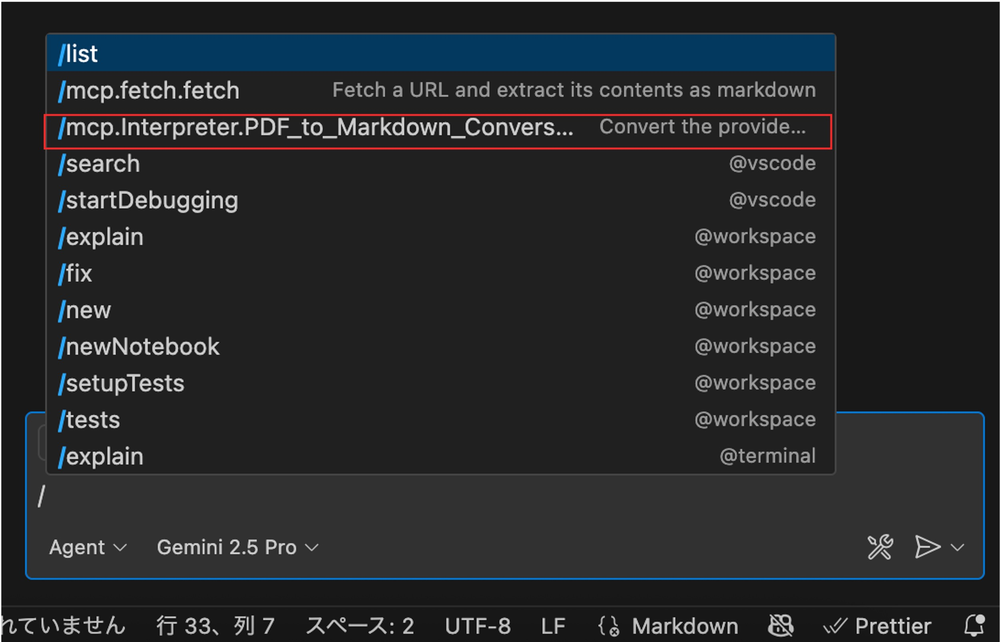
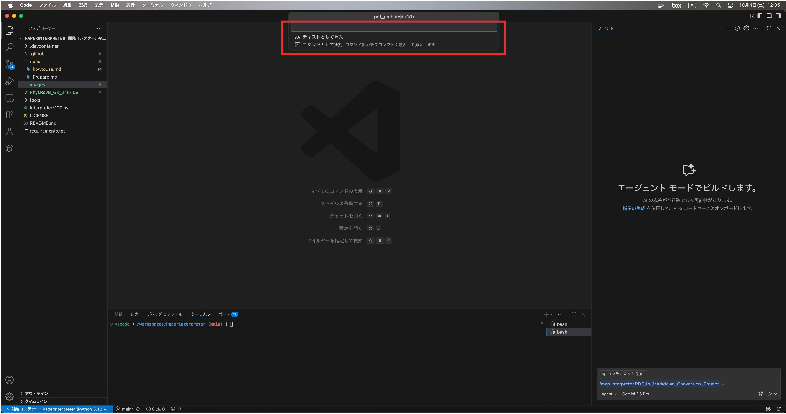

# 使い方（詳細）

以下は「コンテナのビルド → MCP サーバ起動 → prompt に PDF パスを入力 → 実行」という基本フローの各ステップを、VS Code の操作手順（どのアイコン/メニューを使うか）を含めて順番にまとめたものです。実際の画面例は別途追加してください。

## 前提
- Docker Desktop がホストで起動していること（詳しくは [docs/Prepare.md](./Prepare.md) を参照）。
- VS Code でリポジトリを開いていること。
- devcontainer 設定は [.devcontainer/devcontainer.json](.devcontainer/devcontainer.json) にあり、初回ビルド時に [.devcontainer/setup.sh](.devcontainer/setup.sh) が実行されます。

## ステップ 1 — devcontainer のビルド（コンテナ作成 / 起動）
1. VS Code 上部にある コマンドパレット をクリック。  
   1. メニューから「コマンドの表示と実行」を選択。
  
   2. 「開発コンテナー: コンテナでフォルダーを開く (Dev Container: open Folder in Container)」を検索して実行
   3.  代替：Command Palette（Ctrl/Cmd+Shift+P）で同名コマンドを実行しても可。
2. ビルド中は画面下部の「Terminal」タブで [.devcontainer/setup.sh](.devcontainer/setup.sh) の実行ログを確認できます。初回は Python パッケージや Playwright のブラウザ導入に時間がかかります。
3. ビルドが成功すると、左下の表示がコンテナ名に変わり、devcontainer 内で作業できる状態になります。設定や依存は [.devcontainer/devcontainer.json](.devcontainer/devcontainer.json) と [requirements.txt](../requirements.txt) を参照してください。

## ステップ 2 — MCP サーバの起動（Interpreter）
1. VS COde内の「拡張機能」をクリック
2. 「MCPサーバー - インストール済み」に3つのMCPサーバーが記載されているので、それぞれのサーバーアイコンの右にある歯車マークをクリック
3. 「サーバーの起動」をクリックして、サーバーを起動させる

## ステップ3.  GitHub Copilot AgentにMCPサーバーを登録
1. Github Cpilot Chat内でモデルを選択して、「Agent」モードにする
2. 新規チャットを開始し、ツール/プラグイン欄で「Interpreter」または該当の MCP サーバを有効にする（環境によってはツール選択 UI が異なります）。設定参照: [InterpreterMCP.py](../InterpreterMCP.py)（[`InterpreterMCP.MatSci_Interpreter_prompt`](../InterpreterMCP.py)）。
3. 「MCPサーバー: Interpreter」、「MCPサーバー: fetch」、「MCPサーバー: playwright」にチェックをいれて、okを押す

## ステップ 4 — prompt に論文 PDF のパスを入力して実行
1. チャット欄に「/」を入力して、「mcp.Interpreter.PDF_to_Markdown_Conversion_Prompt」を選択
   
2. コマンドパレット内に案内が出るので、解説させたい論文PDFの絶対パスを入力
   
3. エージェントがツールを呼び出すと、`pdf_to_markdown_tool` が実行され、生成物のパス（`dest_dir`）と `md_text` が返されます。実装参照: [`InterpreterMCP.pdf_to_markdown_tool`](../InterpreterMCP.py) と [`tools.PDFTools.pdf_to_markdown`](../tools/PDFTools.py)。
- 注: エージェント経由で実行する際は、MCP サーバのログ（InterpreterMCP を起動したターミナル）やチャットの実行ログを確認してください。

## ステップ 5 — 出力の確認
1. `pdf_to_markdown` の戻り値あるいは MCP の実行結果で示された `dest_dir` を確認します（例: /workspaces/PaperInterpreter/PhysRevB_68_245409/PhysRevB_68_245409/report.md）。  
2. `report.md` をエディタで開き、図のパス（相対パス）や数式が正しく挿入されているか確認します。画像は `materials/` 等に保存されます。
3. 問題があればターミナルのログや [tools/PDFTools.py](../tools/PDFTools.py)、[tools/GoogleSearch.py](../tools/GoogleSearch.py) の実装を参照してデバッグしてください。

補足（トラブルシューティング）
- Docker が動作していない／Desktop が起動していないと devcontainer のビルドに失敗します。事前準備は [docs/Prepare.md](./Prepare.md) を参照してください。  
- API キー等の設定は [.github/.env](../.github/.env) を参照していますが、実運用ではリポジトリに平文で置かないでください（詳細は [docs/Prepare.md](./Prepare.md) を参照）。  
- 直接実行で問題が出る場合は、まず `python -c "import pymupdf; print(pymupdf.__version__)"` 等で依存が正しく入っているか確認します。

## 参照ファイルとシンボル
- [InterpreterMCP.py](../InterpreterMCP.py) — [`InterpreterMCP.pdf_to_markdown_tool`](../InterpreterMCP.py), [`InterpreterMCP.MatSci_Interpreter_prompt`](../InterpreterMCP.py)  
- [tools/PDFTools.py](../tools/PDFTools.py) — [`tools.PDFTools.pdf_to_markdown`](../tools/PDFTools.py)  
- [tools/GoogleSearch.py](../tools/GoogleSearch.py) — [`tools.GoogleSearch.getSearchResponse`](../tools/GoogleSearch.py)  
- [.devcontainer/devcontainer.json](../.devcontainer/devcontainer.json)（devcontainer 設定）  
- [.devcontainer/setup.sh](../.devcontainer/setup.sh)（初期セットアップスクリプト）  
- [docs/Prepare.md](./Prepare.md)（事前準備）
